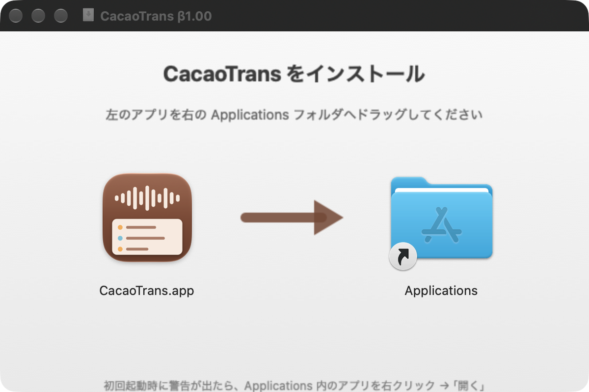
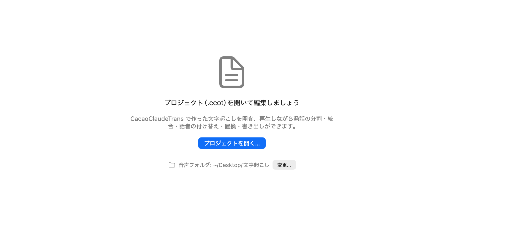
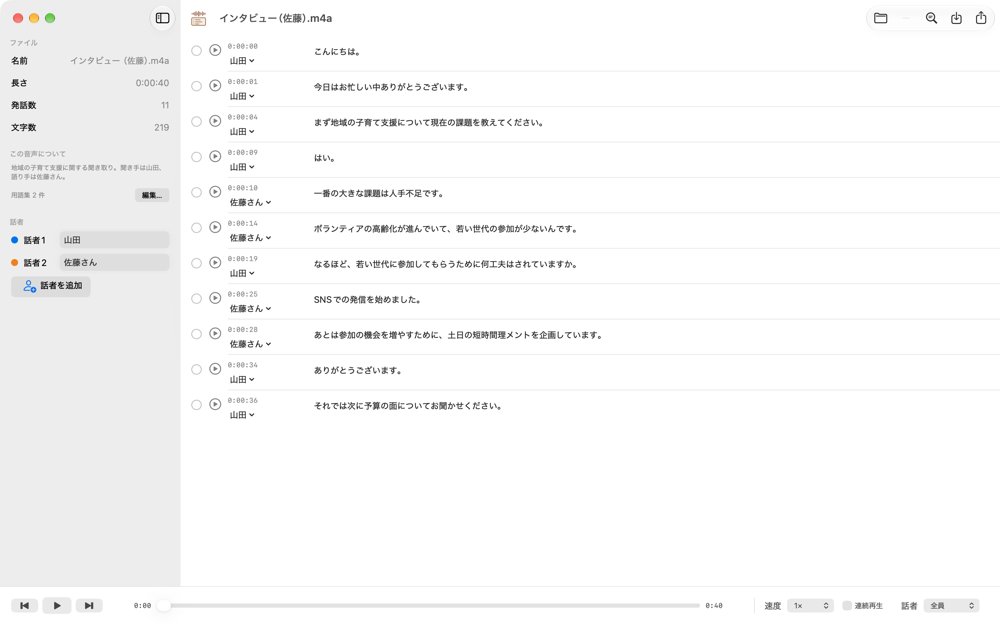
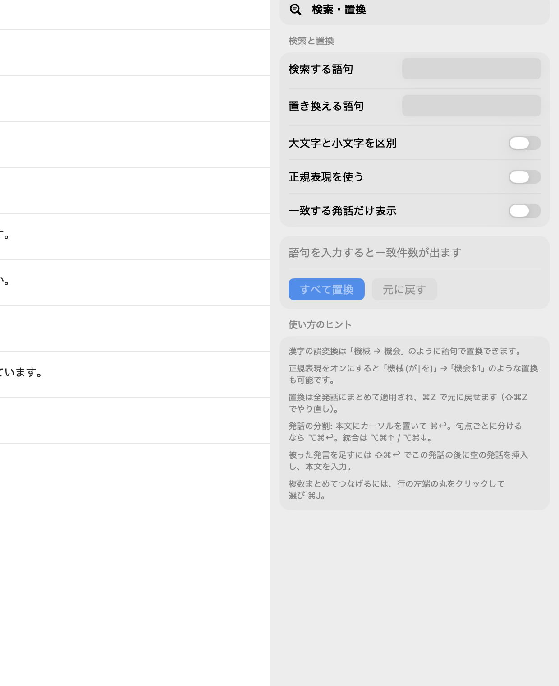
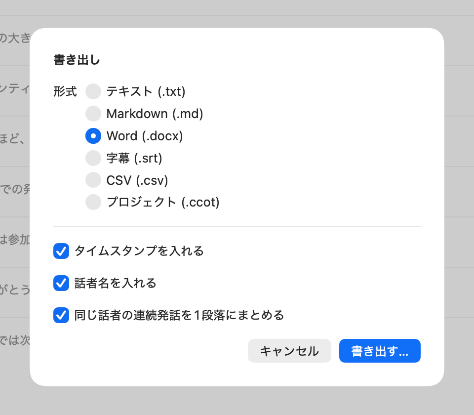

<!-- _class: lead -->
<!-- _paginate: false -->
<!-- _footer: "" -->

# CacaoTrans マニュアル

文字起こしを聞きながら直して、仕上げるためのアプリ
ベータ版 β1.00 ／ 2026 年 9 月

---

## このマニュアルで分かること

1. CacaoTrans のインストールと最初の設定
2. 管理者から受け取ったファイルの置き場所
3. 音声を聞きながら文字起こしを直す手順
4. 保存と納品のしかた
5. 困ったときの対処

> 対応 Mac: **macOS 26 以降**。インターネット接続は不要です。

---

## 作業の全体像

### CacaoClaudeTrans　AI（Claude）による文字起こし

- 音声ファイルから文字起こしを作る
- 話者の分離と AI による下ごしらえ
- プロジェクト（**.ccot**）と音声を渡す

### CacaoTrans 文字起こし結果の編集

- .ccot を開き、音声を聞きながら確認
- 誤変換・話者・区切りを直す
- 保存して納品（.ccot と Word）

> **CacaoTrans**には、AI もクラウドも使いません。

---

## 1. インストール

1. 受け取った **CacaoTrans-β1.00.dmg** をダブルクリック
2. 左の **CacaoTrans** を右の **Applications** へドラッグ
3. dmg を閉じる（デスクトップの取り出しアイコンを取り出す）

**初回起動で「開発元を確認できない」と出たら**
Applications フォルダの CacaoTrans を **右クリック →「開く」→「開く」**。
一度通せば、次からは普通に起動できます。

---

## 2. 最初の設定：音声フォルダ

音声ファイルの置き場所を、**最初に一度だけ**アプリに教えます。

1. CacaoTrans を起動
2. 画面下の **「音声フォルダ」→「変更…」** を押す
3. **書類 › CacaoTrans** を選んで **「このフォルダを使う」**
   （フォルダがなければ自動で作られます）

以後は記憶されるので、毎回の設定は不要です。

> Mac の安全設計により、アプリは勝手に「書類」を読めません。この一手間で許可を与えています。

---

## 3. ファイルの受け取りと置き場所

管理者から **2 つのファイル**が届きます。

| ファイル | 例 | 置き場所 |
|---|---|---|
| プロジェクト | `インタビュー（佐藤）.ccot` | どこでも可（書類 › CacaoTrans がおすすめ） |
| 音声 | `インタビュー（佐藤）.m4a` | **書類 › CacaoTrans** の中 |

- 音声の**ファイル名は変えない**でください。名前で探します。
- 音声はサブフォルダ（例: 書類 › CacaoTrans › 2026-09）に入れても見つかります。

---

## 4. プロジェクトを開く

- **.ccot をダブルクリック**するだけで CacaoTrans が開きます
- または CacaoTrans を起動して **「プロジェクトを開く…」**（<kbd>⌘</kbd><kbd>O</kbd>）

開くと音声が自動でつながり、画面下に再生バーが出ます。

> 「音声ファイルが見つからないため再生できません」と出たら → 15.「困ったとき」へ

---

## 5. 画面の見方

---

## 5. 画面の見方（つづき）

**左：サイドバー**
- ファイル名・長さ・発話数
- この音声について（背景・用語集）
- **話者**：表示名をここで付ける（話者1 → 山田 など）

**中央：発話一覧**
- 1 行が 1 つの発話
- 左から ○（選択）、▶（再生）、時刻と話者、本文

**右：検索・置換パネル**（<kbd>⌘</kbd><kbd>F</kbd> で表示）

**下：再生バー**
- 再生／一時停止、前後の発話、位置スライダー
- 速度（0.75×〜2×）
- 連続再生（オンで止まらず次へ）
- 話者の絞り込み

---

## 6. 聞いて確認する

画面下の再生バー。左から「前の発話」「再生／一時停止」「次の発話」、位置スライダー、速度、連続再生、話者の絞り込み。

**基本**
- 行の ▶ を押すと、その発話だけ再生して止まる
- もう一度押すと一時停止
- 再生中の行は色が付き、画面が自動で追従

**速く進めたいとき**
- <strong>連続再生</strong> をオンにすると止まらず次へ
- <kbd>⌘</kbd><kbd>↓</kbd> 次の発話 ／ <kbd>⌘</kbd><kbd>↑</kbd> 前の発話
- <strong>速度</strong> を 1.25× や 1.5× に

**ひとりの話者だけ聞きたいとき**
- 右端の <strong>話者</strong> でその人を選ぶ

---

## 7. 本文を直す

- 本文をクリックしてそのまま書き換えます（普通のテキスト入力）
- 改行を入れたいときは <kbd>⌥</kbd><kbd>↩︎</kbd>
- 直した内容はすぐ反映され、あとで **保存**（<kbd>⌘</kbd><kbd>S</kbd>）します

**AI が直した箇所には ✨ マークが付いています**
- マウスを乗せると、直す前の文が見えます
- 右クリック →「校正前の文に戻す」で元に戻せます

> 意味を変えない範囲で、聞こえたとおりに直すのが基本です。

---

## 8. 話者を直す

**1 行だけ変える**
- 行の話者名（例「山田 ⌄」）をクリック → 別の話者を選ぶ

**まとめて変える**
- 行の左端の ○ をクリックして複数選ぶ
- 上に出るバーの <strong>話者をまとめて変更</strong>

**表示名を付ける**
- サイドバーの「話者」欄に名前を入力（話者1 → 山田）
- 書き出し時にこの名前が使われます

**話者が足りないとき**
- サイドバーの <strong>話者を追加</strong>

> 話者は声の似方で機械が判定しているため、取り違えがあります。聞いて確認しながら付け替えてください。

---

## 9. 発話を分ける・つなげる

| やりたいこと | 操作 |
|---|---|
| 途中で分ける | 本文の分けたい位置にカーソルを置いて <kbd>⌘</kbd><kbd>↩︎</kbd> |
| 句点（。？！）ごとに分ける | 本文にカーソルを置いて <kbd>⌥</kbd><kbd>⌘</kbd><kbd>↩︎</kbd> |
| 前の発話とつなげる | <kbd>⌥</kbd><kbd>⌘</kbd><kbd>↑</kbd> |
| 次の発話とつなげる | <kbd>⌥</kbd><kbd>⌘</kbd><kbd>↓</kbd> |
| 複数をまとめてつなげる | 左端の ○ で選んで <kbd>⌘</kbd><kbd>J</kbd> |
| 選択した行を削除 | ○ で選んで、上のバーの「削除」 |

- どれも **右クリックメニュー**からも実行できます
- 間違えたら <kbd>⌘</kbd><kbd>Z</kbd> で元に戻せます

---

## 10. 拾われなかった発言を足す

相づちや、話が被った部分は文字起こしに入っていないことがあります。

1. その直前の発話の本文にカーソルを置く
2. <kbd>⇧</kbd><kbd>⌘</kbd><kbd>↩︎</kbd> を押す → **下に空の行**が入り、話者は自動で「相手側」になる
3. 聞こえた内容を入力する

- 前に入れたいときは <kbd>⇧</kbd><kbd>⌥</kbd><kbd>⌘</kbd><kbd>↩︎</kbd>
- 空のまま残しても、書き出し時には無視されます

---

## 11. 同じ間違いをまとめて直す（検索・置換）

1. <kbd>⌘</kbd><kbd>F</kbd> で右側にパネルを開く
2. 「検索する語句」に間違い、「置き換える語句」に正しい表記
3. 件数を確認して **「すべて置換」**

例：機械 → 機会、斎藤 → 齋藤

- <strong>一致する発話だけ表示</strong> をオンにすると該当行だけ並びます
- 置換も <kbd>⌘</kbd><kbd>Z</kbd> で元に戻せます

---

## 12. 保存する

- <kbd>⌘</kbd><kbd>S</kbd> で **プロジェクト（.ccot）に上書き保存**
- ウインドウ上部に「未保存の変更あり」と出ていたら、まだ保存されていません
- 作業を中断するときも <kbd>⌘</kbd><kbd>S</kbd>。次回はそのファイルを開けば続きから

> こまめに保存してください。保存しないまま閉じると、その分の作業は失われます。

---

## 13. 書き出して納品する

1. <kbd>⌘</kbd><kbd>E</kbd> で書き出しダイアログ
2. 形式を選ぶ（通常は **Word (.docx)**）
3. 「タイムスタンプ」「話者名」「同じ話者の連続発話を 1 段落にまとめる」を必要に応じて調整
4. 「書き出す…」で保存先を選ぶ

**納品するもの**
- 仕上げた **.ccot**（再編集できる）
- **Word ファイル**（読む人向け）

---

## 14. ショートカット一覧

| 操作 | キー | 操作 | キー |
|---|---|---|---|
| プロジェクトを開く | <kbd>⌘</kbd><kbd>O</kbd> | 保存 | <kbd>⌘</kbd><kbd>S</kbd> |
| 書き出し | <kbd>⌘</kbd><kbd>E</kbd> | 検索・置換 | <kbd>⌘</kbd><kbd>F</kbd> |
| 再生／一時停止 | <kbd>⇧</kbd><kbd>⌘</kbd><kbd>P</kbd> | 次／前の発話 | <kbd>⌘</kbd><kbd>↓</kbd> ／ <kbd>⌘</kbd><kbd>↑</kbd> |
| カーソル位置で分割 | <kbd>⌘</kbd><kbd>↩︎</kbd> | 句点で分割 | <kbd>⌥</kbd><kbd>⌘</kbd><kbd>↩︎</kbd> |
| 前／次とつなげる | <kbd>⌥</kbd><kbd>⌘</kbd><kbd>↑</kbd> ／ <kbd>↓</kbd> | 選択をつなげる | <kbd>⌘</kbd><kbd>J</kbd> |
| 後ろに発話を挿入 | <kbd>⇧</kbd><kbd>⌘</kbd><kbd>↩︎</kbd> | 前に発話を挿入 | <kbd>⇧</kbd><kbd>⌥</kbd><kbd>⌘</kbd><kbd>↩︎</kbd> |
| 元に戻す | <kbd>⌘</kbd><kbd>Z</kbd>（やり直し <kbd>⇧</kbd><kbd>⌘</kbd><kbd>Z</kbd>） | 本文内で改行 | <kbd>⌥</kbd><kbd>↩︎</kbd> |

---

## 15. 困ったとき

| 症状 | 対処 |
|---|---|
| 「音声ファイルが見つからない」 | 音声が **書類 › CacaoTrans** にあるか、名前が変わっていないか確認。それでも出るなら再生バーの **「音声ファイルを指定…」** で直接選ぶ |
| 「開発元を確認できない」で起動しない | Applications の CacaoTrans を右クリック →「開く」 |
| .ccot をダブルクリックしても別のアプリが開く | ファイルを右クリック →「このアプリケーションで開く」→ CacaoTrans |
| 操作を間違えた | <kbd>⌘</kbd><kbd>Z</kbd>。何度でも戻せます |
| アプリが落ちた | 最後に保存した .ccot から再開。落ちたときの状況を管理者へ |

---

<!-- _class: lead -->
<!-- _footer: "" -->

# CacaoTrans

分からないことや不具合は、画面の写真を添えて管理者へ連絡してください。

CacaoTrans β1.00 ／ © 2026 ICTCacao

